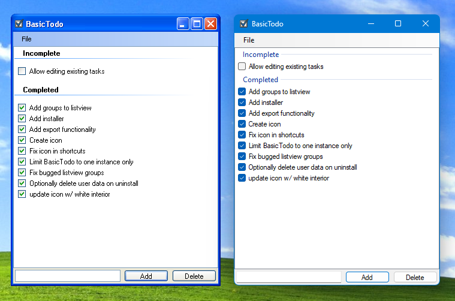

# BasicTodo

A simple Windows XP-era to-do list app built with .NET Framework 3.5 and Windows Forms (C#). Features include:

- Add, check off, and delete tasks
- Completed and pending items separated into groups
- Persistent storage (`todos.txt`) in `%APPDATA%\BasicTodo`
- Markdown **Export** and **Import** (with duplicate-check and status preservation)

---

## Screenshot

---

## Usage

1. **Add a task** by typing into the textbox and pressing **Enter** or clicking **Add**.  
2. **Toggle completion** by clicking the checkbox next to an item.  
3. **Delete** selected tasks using the **Delete** button or right-click (if implemented).  
4. **Export** your list to Markdown via **File -> Export**.  
5. **Import** a `.md` file formatted like `- [ ] Task` or `- [x] Task` via **File -> Import** — new items (matching text) are skipped.  

---

**Building**  
- Requires Visual Studio 2008 and .NET Framework 3.5.  
- Open the solution, build the project, then build the Setup Project to create the installer.

---

Made with care in C# WinForms for simplicity and compatibility.
